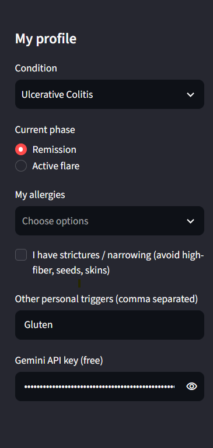
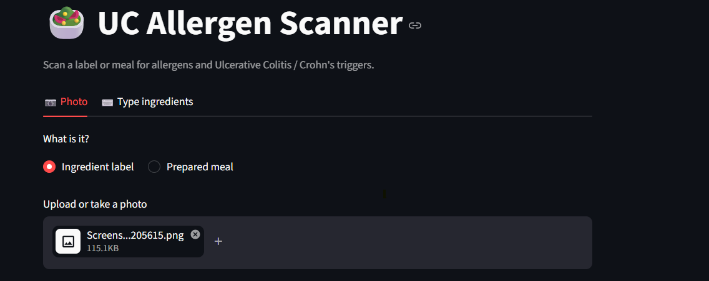
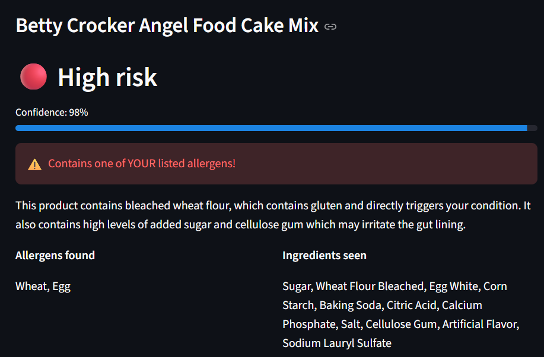
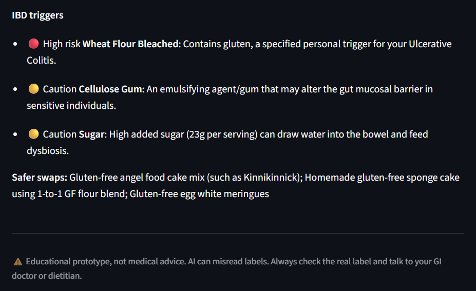

# UC-Allergen-Scanner

An AI-powered app that scans a food label or meal photo and flags **allergens** and **trigger ingredients for Ulcerative Colitis and Crohn's disease**, personalized to the user's profile.

> ⚠️ Educational prototype, not medical advice. AI can misread labels. Always check the real label and talk to your GI doctor or dietitian.

## Deliverables
| | Link |
|---|---|
| **A. Working AI prototype** | This repo (`app_gemini.py`). Run steps below |
| **B. Figma design** | [Figma prototype](PASTE-FIGMA-LINK-HERE) and exported screens in [`design/`](design/) |
| **C. Video pitch (3 min)** | [Watch the video](PASTE-VIDEO-LINK-HERE) |

## The problem
Reading ingredient labels with UC or Crohn's is stressful. Standard allergen apps only flag the top major allergens, and miss common IBD irritants like carrageenan, polysorbate 80, cellulose gum, artificial sweeteners and high-FODMAP ingredients.

## What it does
- **Photo or text input:** upload a label (OCR) or a meal photo (vision), or type in ingredients.
- **Personal profile:** condition, remission vs. active flare, allergies, strictures, and custom triggers. Flare mode is stricter.
- **Traffic-light risk:** 🟢 low, 🟡 caution, 🔴 high, with a short reason for every flagged ingredient.
- **Confidence score** so users know when the AI is unsure.
- **Safer swaps** ("best match" / "good match") with an explanation of why they were picked.
- **Scan history** for the session.

## Screenshots (working prototype)

## Design (Option B)
The Figma prototype shows the mobile experience: welcome, profile setup, camera capture, analyzing, results and safer swaps. The prototype implements the profile, scan, analyzing steps, results, swaps and history. The welcome screen and camera frame are mobile-only ideas that are part of the design vision.

## How AI is used
A multimodal Gemini model reads the image, extracts ingredients, and reasons over them against the user's profile (condition, flare vs. remission, allergies, custom triggers). It returns structured JSON, which the app turns into the risk badge, confidence score, triggers and swaps. The app retries automatically if the model is busy.

## Run it yourself
1. Install Python 3.9+.
2. Install packages: `pip install streamlit google-genai`
3. Get a free API key at https://aistudio.google.com
4. Start the app: `python -m streamlit run app_gemini.py`
5. Paste your key in the sidebar. **Never commit your key to GitHub.**

(`app.py` is an equivalent version that uses the Anthropic API instead.)

## Limitations and next steps
- AI can misread blurry labels, so every result shows a confidence score and disclaimer.
- Add more conditions (celiac disease, IBS, GERD) and saved custom trigger lists
- Permanent history and a mobile app version
- Clinician review of the trigger knowledge before real-world use
